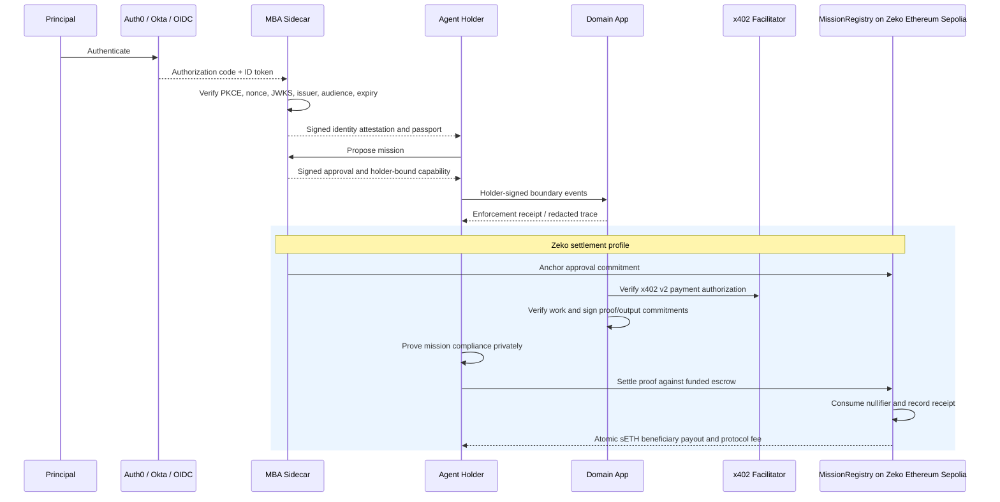
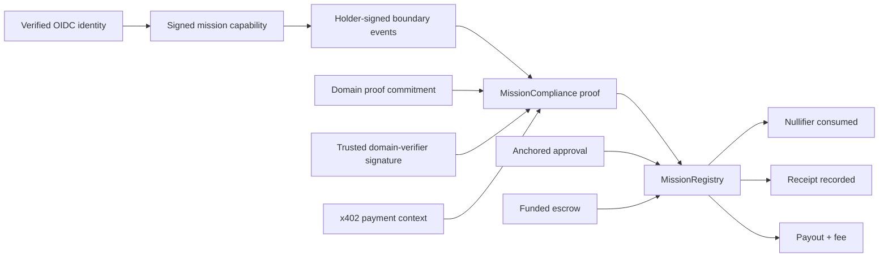
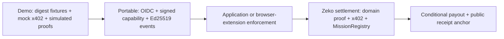

# Architecture

MBA is layered. Portable authorization ends after application enforcement and
receipt export; the settlement profile continues through x402 and Zeko.

## Proof And Registry

Domain apps own work semantics and domain proof generation. MBA pins their
approved Pallas verifier keys, proves the verifier signature inside
MissionCompliance, independently verifies disclosed evidence during receipt
verification, and owns authority, policy proof, replay resistance, receipt
binding, and Zeko settlement. The private-compute harness is one adapter, not
the protocol boundary.

## Profile Boundaries

Portable mode has no central compute, TEE, facilitator, or chain runtime
dependency. Zeko settlement is a stronger continuation for proof-backed
commerce, not a prerequisite for mission-bound browser authorization.
